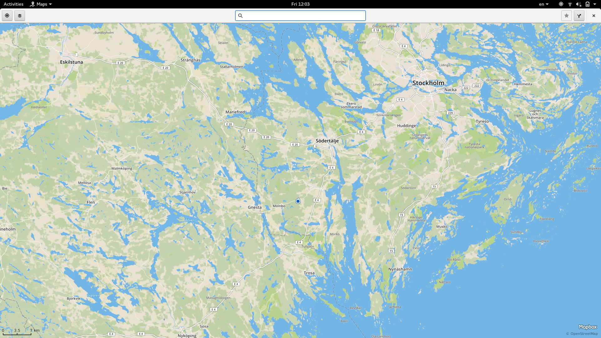

# gps-share

Utility to share your GPS device on local network.

Git master build status: 

## Goals

gps-share has two goals:

* Share your GPS device on the local network so that all machines in your home
  or office can make use of it.
* Enable support for standalone (i-e not part of a cellular modem) GPS devices
  in Geoclue. Since Geoclue has been able to make use of network NMEA sources
  since 2015, gps-share works out of the box with Geoclue.

The latter means that it is a replacement for
[GPSD](https://en.wikipedia.org/wiki/Gpsd) and
[Gypsy](https://gypsy.freedesktop.org/wiki/). While ["why not GPSD?" has already
been documented](https://gypsy.freedesktop.org/why-not-gpsd.html), Gypsy has
been unmaintained for many years now. I did not feel like reviving a dead
project and I really wanted to code in Rust so I decided to create gps-share.

## Dependencies

While cargo manages the Rust crates gps-share depend on, you'll also need the
following on your host:

* libdbus
* libudev
* libcap
* xz-libs

## Supported devices

gps-share currently only supports GPS devices that present themselves as serial
port (RS232). Many USB are expected to work out of the box but bluetooth devices
need manual intervention to be mounted as serial port devices through rfcomm
command. The following command worked on my Fedora 25 machine for a TomTom
Wireless GPS MkII.

    sudo rfcomm connect 0 00:0D:B5:70:54:75

gps-share can autodetect the device to use if it's already mounted as a serial
port but it assumes a baudrate of 38400. You can manually set the device node to
use by passing the device node path as argument and set the baudrate using the
'-b' commandline option. For example for the TomTom Wireless GPS MkII device,
you'll nee to set the baudrate to 115200.

Pass '--help' for a full list of supported commandline options.

## Permisions

gps-share will need read and write access to device nodes. Adding your user to
'dialout' group gives you this access for USB devices on Fedora hosts but it is
not the case for the /dev/rfcomm0 device created by the above mentioned command.
For those devices, you'll either need to run gps-share as root or set permission
on /dev/rfcomm0.

## Supported operating systems

gps-share is targetted specifically for Linux. It may or may not work on other
POSIX hosts. Patches to add/fix support for non-Linux systems, are more than
welcome.

On Fedora, you might need to either disable selinux or configure it to allow
gps-share to start and announce a TCP service.
